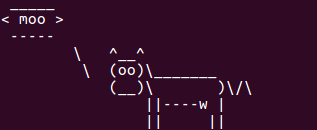
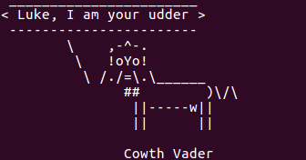

---
---

Cowsay
---
'cowsay' is a program that shows a ASCII picture of a cow saying a message inside the terminal.

To use 'cowsay', simply type:

~~~bash
$ cowsay "your message"
~~~

This script uses ascii art to show a cow in the terminal saying anything you tell it to say.

`cowsay`  is not built-in to your terminal and in order to use it, you have to install it to your machine. 

If you are using a linux machine, do the following steps:

~~~bash
$sudo apt-git install cowsay
~~~

### Useful Commands / Examples 
- `-f cowfile` - specifies from which file to load ascii art (cowsay -f vader.cow - turns the cow into Cowth Vader) 
- `-e` - this followed by two characters specifies what to replace as the cows eyes (cowsay -e ^^ -turns the cows eyes into ^s)
- `-l` - gives a list of the different cowfiles that you can use

#### Example command
~~~bash
$cowsay Moo
~~~

##### Break it down
<!--  -->
 

##### Example command
~~~bash
$cowsay -f vader.cow "Luke, I am your udder"
~~~

##### Break it down

